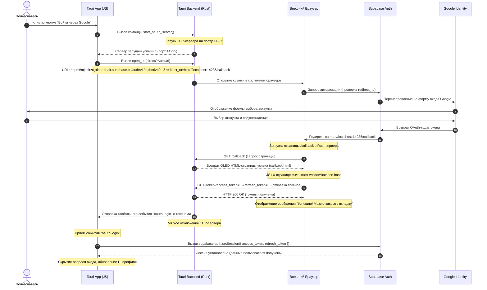

# Спецификация дизайна: Прямая авторизация Google OAuth в Minecraft P2P Connector

**Дата**: 2026-05-20  
**Автор**: Antigravity  
**Статус**: APPROVED (Архитектура согласована с пользователем, Redirect URL добавлен в Supabase)

---

## 1. Контекст и Проблема

В предыдущих версиях авторизация через Google OAuth приводила к ошибке `bad_oauth_state` (OAuth state not found or expired) и неконтролируемым редиректам на `http://localhost:3000`. 

### Причины сбоя:
1. Адрес перенаправления локального HTTP-сервера Tauri (`http://localhost:14235/callback`) не был добавлен в список разрешенных Redirect URLs в панели Supabase Dashboard. Из-за этого Supabase блокировал перенаправление на локальный порт и принудительно возвращал пользователя на стандартный Site URL (`http://localhost:3000`), где не было инициализированного стейта авторизации.
2. Внешний браузер и приложение Tauri не имели синхронизированного состояния сессии, что вызывало сбой CSRF-защиты (state) при попытке выполнить вход напрямую.

---

## 2. Предложенное Решение (Прямой поток авторизации)

Пользователь успешно добавил `http://localhost:14235/callback` in Redirect URLs в панели Supabase. Это позволяет нам использовать **чистый прямой поток** без промежуточных серверов.

### Архитектура и поток данных (Data Flow):

---

## 3. Компоненты системы

### А. Бэкенд Tauri (`src-tauri/src/main.rs`):
*   **Команда `start_oauth_server`**:
    *   Запускает асинхронный `tokio::net::TcpListener` на `127.0.0.1:14235`.
    *   Слушает GET-запросы:
        *   `/callback`: возвращает красивую OLED HTML-страницу (`callback.html`), которая считывает хэш параметров и отправляет их на `/token`.
        *   `/token`: извлекает параметры `access_token` и `refresh_token`, отправляет событие `oauth-login` во фронтенд через `app.emit` и завершает работу сервера.
        *   `/success` / `/error`: вспомогательные страницы отображения статуса для пользователя.
*   **Команда `open_url`**:
    *   Открывает URL в системном браузере по умолчанию с использованием `cmd /C start` (на Windows).

### Б. Фронтенд Tauri (`src/main.js`):
*   **Инициализация (`initAuth`)**:
    *   Регистрирует слушатель событий Tauri: `listen("oauth-login", async (event) => { ... })`.
    *   При получении события извлекает `access_token` и `refresh_token`, вызывает `supabase.auth.setSession(...)`.
    *   При успешной установке сессии скрывает окно авторизации и обновляет профиль (`populateProfilePanel`).
*   **Обработчик кнопки Google (`#btn-google`)**:
    *   Переводит кнопку в состояние загрузки ("Ожидание авторизации в браузере...").
    *   Вызывает `invoke("start_oauth_server")`.
    *   Строит прямую ссылку авторизации:
        `https://mjbqlrzcijxlontrbhak.supabase.co/auth/v1/authorize?provider=google&redirect_to=http://localhost:14235/callback`
    *   Вызывает `invoke("open_url", { url: directOAuthUrl })`.

---

## 4. План тестирования и верификации

1. **Компиляция**: Запуск `npm run tauri build` или `npm run tauri dev` для проверки синтаксиса Rust и JS.
2. **Проверка портов**: Убедиться, что порт 14235 освобождается после завершения авторизации или таймаута (180 секунд).
3. **End-to-End тест**:
   * Запуск приложения.
   * Нажатие на кнопку Google.
   * Выбор аккаунта в системном браузере Chrome/Edge.
   * Автоматический редирект на OLED-страницу успеха в браузере.
   * Мгновенный автоматический вход в Tauri-приложении и переход на экран профиля.
